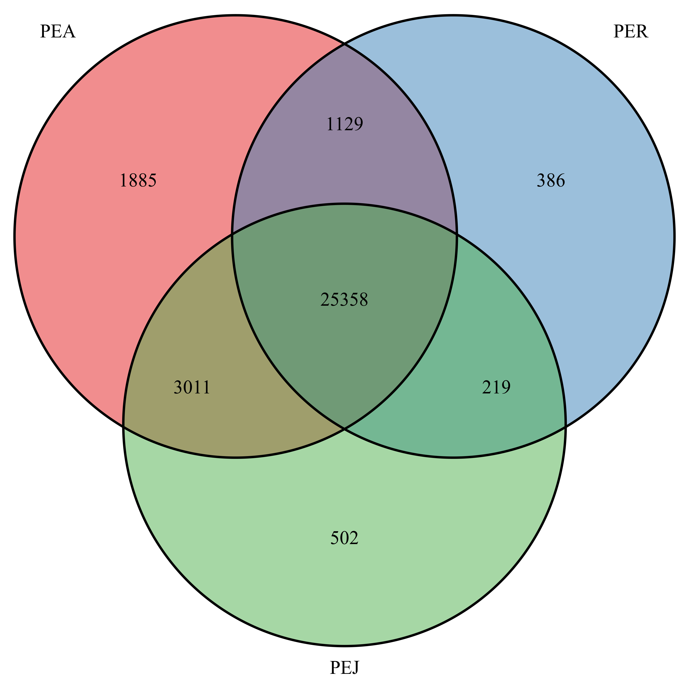
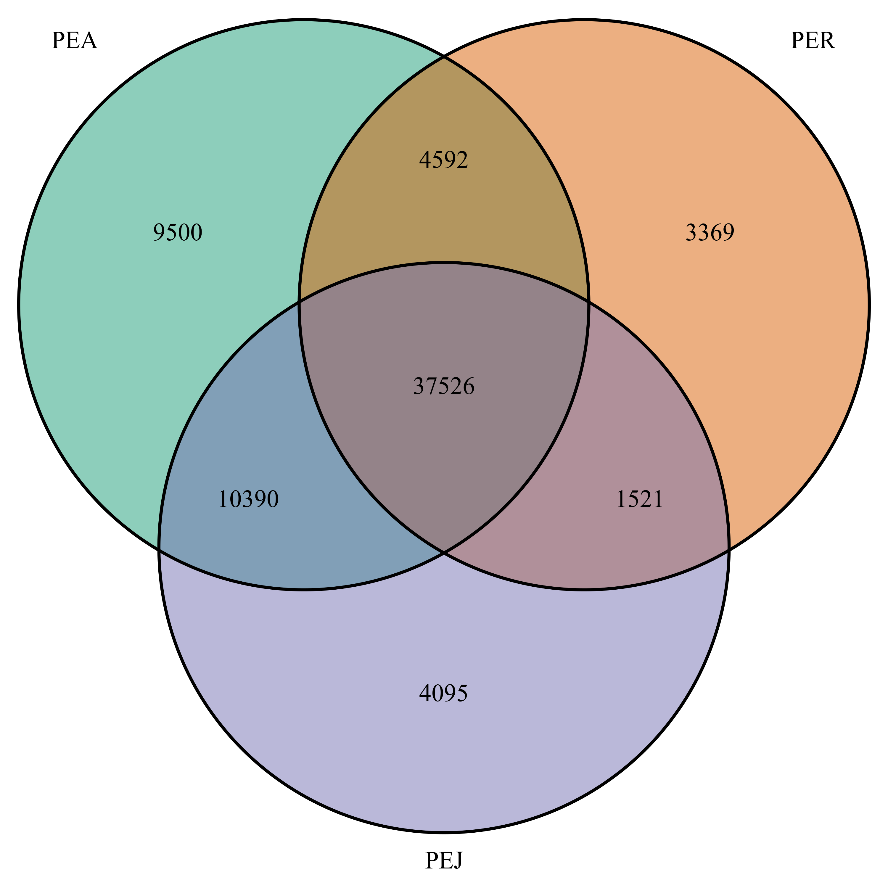

# final\_task

O gênero Passiflora é o mais amplo da família Passifloraceae, possuindo
cerca de 500 espécies, que se distribuem nas regiões neotropicais
(Feuillet et al., 2004). A principal espécie cultivada no Brasil é a
*Passiflora edulis*, popularmente conhecido como maracujá amarelo ou
azedo. O Brasil é o maior produtor e consumidor de maracujá no mundo.
São poucos os estudos moleculares recentes relacionados ao
desenvolvimento dessa espécie, logo, estou realizando um estudo
utilizando a metodologia de sequenciamento de RNA (RNA- Seq) visando
buscar por genes/isoformas diferencialmente expressos em diferentes
fases do desenvolvimento do maracujá. O transcriptoma é reflexo direto
da expressão gênica e tem como objetivo a avaliação do conjunto de
transcritos de um organismo em determinada situação celular. Assim, essa
metodologia se mostra mais eficiente e apresenta maior acurácia nos
resultados em conjunto com a utilização de plataformas de bioinformática
para análise do transcriptoma da planta, realizando uma análise
comparativa das diferentes fases do desenvolvimento.

Resumidamente, foram coletos ápices caulinares em 3 diferentes fases do
desenvolvimento do maracujá: - Juveni - Adulto - Reprodutivo

O RNA total foi extraído desse material e enviado para sequenciamento.
Os dados obtidos foram processador para remoção de adaptadores e bases
de baixa qualidade, em seguida foi realizada a montagem de novo do
transcritpoma (quando não se tem um genoma para usar como referência).
Posteriormente foi feita uma análise de abundância de cada transcrito no
material, e uma analise de express~ao gênica desses transcritos, ou
seja, o quanto estão sendo expressos. Essa análise são os dados que
utilizei no presente trabalho.

Utilei 2 bases uma contendo os genes: PEA.PEJ.g e outra contendo
isoformas: PEA.PEJ.i (Um gene pode apresentar diferentes isoformas
devido ao processo denominado splicing alterantivo do RNA mensageiro).

#### Carregando as bases:

``` r
norm.df <- read.delim(file="PEA-PEJ.g.txt",
                         sep="\t",
                         header=TRUE,
                         stringsAsFactors = FALSE)
```

``` r
norm.i.df <- read.delim(file="PEA-PEJ.i.txt",
                         sep="\t",
                         header=TRUE,
                         stringsAsFactors = FALSE)
```

## Manipulação dos dados

#### Selecionando os dados de interesse:

Dentro da base de dados, meu objetivo foi selecionar apenas aqueles que
apresentam uma expressão equivalente AO MENOS 1 EM TODAS AS RÉPLICAS DAS
AMOSTRAS:

``` r
pea.ss.df <- subset(norm.df, ((PEA_B2 >= 1)&(PEA_B3 >= 1)&(PEA_B5 >= 1)) )
pej.ss.df <- subset(norm.df, ((PEJ_B2 >= 1)&(PEJ_B3 >= 1)&(PEJ_B4 >= 1)) )
per.ss.df <- subset(norm.df, ((PER_B2 >= 1)&(PER_B3 >= 1)&(PER_B4 >= 1)) )
```

``` r
ipea.ss.df <- subset(norm.i.df, ((PEA_B2 >= 1)&(PEA_B3 >= 1)&(PEA_B5 >= 1)) )
ipej.ss.df <- subset(norm.i.df, ((PEJ_B2 >= 1)&(PEJ_B3 >= 1)&(PEJ_B4 >= 1)) )
iper.ss.df <- subset(norm.i.df, ((PER_B2 >= 1)&(PER_B3 >= 1)&(PER_B4 >= 1)) )
```

#### Pegando apenas a coluna de identificação (X) e salvando o resultado em novas tabelas:

``` r
write.table(pea.ss.df$X, file="GPEA.txt", col.names=FALSE, row.names=FALSE, sep="\t", quote=FALSE)
write.table(per.ss.df$X, file="GPER.txt", col.names=FALSE, row.names=FALSE, sep="\t", quote=FALSE)
write.table(pej.ss.df$X, file="GPEJ.txt", col.names=FALSE, row.names=FALSE, sep="\t", quote=FALSE)
```

``` r
write.table(ipea.ss.df$X, file="IPEA.txt", col.names=FALSE, row.names=FALSE, sep="\t", quote=FALSE)
write.table(iper.ss.df$X, file="IPER.txt", col.names=FALSE, row.names=FALSE, sep="\t", quote=FALSE)
write.table(ipej.ss.df$X, file="IPEJ.txt", col.names=FALSE, row.names=FALSE, sep="\t", quote=FALSE)
```

## Geração do gráfico

O objetivo dessa análise é analisar o número de genes que estão sendo
expressos em cada condição. Foi então utilizado o diagrama de venn para
demonstrar o resultado:

#### Carregando os pacotes necessários previamente já instalados:

``` r
library(VennDiagram)
#> Loading required package: grid
#> Loading required package: futile.logger
library (RColorBrewer)
```

#### Criando objetos com as cores a serem utilizadas no gráfico:

``` r
myCol <- brewer.pal(3, "Set1")
```

``` r
myCol2 <- brewer.pal(3, "Dark2")
```

#### Geração dos diagramas:

PEJ: Fase juvenil PEA: Fase adulta PER: Fase reprodutiva

``` r
venn.diagram(
 x = list(pea.ss.df$X, per.ss.df$X, pej.ss.df$X),
 category.names = c("PEA" , "PER" , "PEJ"),
 fill=myCol,
 filename = 'venn_diagram_genes.png',
 imagetype="png",
 output=TRUE
)
#> [1] 1
```

<div class="figure">



<p class="caption">

A caption

</p>

</div>

``` r
venn.diagram(
 x = list(ipea.ss.df$X, iper.ss.df$X, ipej.ss.df$X),
 category.names = c("PEA" , "PER" , "PEJ"),
 fill=myCol2,
 filename = 'venn_diagram_isoforms.png',
 imagetype="png",
 output=TRUE
)
#> [1] 1
```

<div class="figure">



<p class="caption">

A caption

</p>

</div>

Comparando os dois gráficos, podemos observar que os genes em *P.edulis*
apresentam várias isoformas. O próximo passo é realizar a anotação
funcionas dos genes/isoformas e a análise de expressão gênica
diferencial, ou seja quais genes estão sendo expressos em uma condição e
não na outra , ou em diferentes niveis. As intersecções mostram o número
de genes/isoformas expressas em ambas as condições. Em seguida pode-se
fazer um heatmap dos genes de interesse.

OBS: Gostaria de ter feito o heatmap mais não terei tempo devido ao
doutorado. Essa semana tenho que dar continuidade a outro projeto de
transcriptômica e não poderei terminar.
